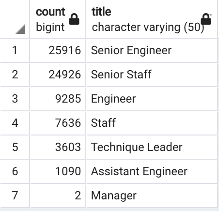

# Pewlett-Hackard-Analysis

## Overview
The purpose of this analysis is to study the data of Pewlett Hackard to help prepare for the "silver tsunami". 

### Purpose
This analysis will determine the number of retiring employees per title and identify employees who are eligible to participate in a mentorship program

## Results
The result of this analysis are below:

- A total of 72458 employees are retiring.

- More senior staffs are retiring compared to other staff members. From the table below we can see that approximately 70% of the retiring staffs are Senior Engineer or Senior Staff. There are 2 Managers and 3603 Technical Leaders retiring staffs.



- After using SQL, to write a query to get eligible mentors, the following candidates are found best suited for the mentorship program.

[mentorship program](Data/mentorship_eligibilty.csv)

- There are 1549 eligible candidates for the mentorship program where as there are 72458 distinct retiring titles that needs to be filled. Pewlett Hackard would need more eligible candidates to help prepare for the "silver tsunami". 

## Summary

### How many roles will need to be filled as the "silver tsunami" begins to make an impact?

72458 roles needs to be filled as the "silver tsunami" begins to make an impact. Most of these roles are for senior positions and two are for manager's.

### Are there enough qualified, retirement-ready employees in the departments to mentor the next generation of Pewlett Hackard employees?

There aren’t enough employees eligible for mentor ship program. each Mentor will have approximately 46 candidates to mentees. However, if we extend the mentorship eligibility by one year, we will have 19905 mentors. This would give each mentor only 3 - 4 mentees approximately. 

Below is the code for this query:

```sql
SELECT
	DISTINCT ON (employees.emp_no)
	employees.emp_no, 
	employees.first_name, 
	employees.last_name,
	employees.birth_date,
	dept_emp.from_date,
	dept_emp.to_date,
	titles.title
INTO
	mentorship_eligibilty_twoYear
FROM 
	employees
INNER JOIN 
	dept_emp
ON 
	employees.emp_no = dept_emp.emp_no
	INNER JOIN 		
		titles
	ON
		employees.emp_no = titles.emp_no
WHERE
	dept_emp.to_date = '9999-01-01'
AND 
	(employees.birth_date BETWEEN '1964-01-01' AND '1965-12-31')
ORDER BY
	employees.emp_no

```

